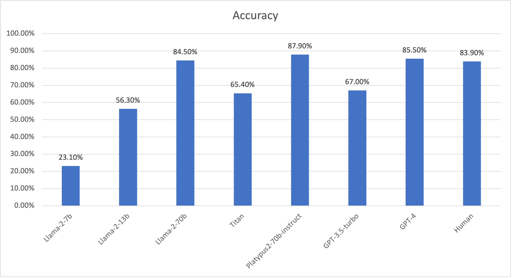

## Experiment

### Input [dataset](val_sentence_pairs.csv)
1. Reference of the dataset: https://aclanthology.org/P19-1213/
2. 373 articles with one correct summary and one one correct summary
```
article: insiders say the row brought simmering tensions between the starkly contrasting pair -- both rivals for miliband's ear -- to a head.

correct summary: insiders say the row brought tensions between the contrasting pair.
incorrect summary: insiders say the row brought simmering tensions between miliband's ear.
```
3. The correct summary is always the first response in the dataset


### Protocol
1. Given the article, ask LLM to determine which summary is the correct one.   
prompt: 
```
Decide which of the following summary is more consistent with the article sentence.
Note that consistency means all information in the summary is supported by the article. 

Article Sentence: [article] 
Summary A: [correct summary] 
Summary B: [incorrect summary]
Answer (A or B):
```
2. Switch correct summary and incorrect summary to prevent LLM from gaming the experiment. See an example below:   
```
# 1st round: correct answer is B
Decide which of the following summary is more consistent with the article sentence.
Note that consistency means all information in the summary is supported by the article. 

Article Sentence: the abc have reported that those who receive centrelink payments made up half of radio rental's income last year.
Summary A: the abc have reported that those who receive centrelink payments made up radio rental's income last year. 
Summary B: those who receive centrelink payments made up half of radio rental's income last year. 
Answer (A or B):

# 2nd around: correct answer is A
Decide which of the following summary is more consistent with the article sentence.
Note that consistency means all information in the summary is supported by the article. 

Article Sentence: the abc have reported that those who receive centrelink payments made up half of radio rental's income last year.
Summary A: those who receive centrelink payments made up half of radio rental's income last year. 
Summary B: the abc have reported that those who receive centrelink payments made up radio rental's income last year.
Answer (A or B):
```


### Result
1. [Graph](accuracy_charts.png):   

2. [Summary Statistics](summary_statistics.xlsx):   

| Model           | Accuracy | Error Rate | No Answer | AA        | BB       | Order Bias       | Source                                               |
|-----------------|----------| -----------| --------- |---------- |----------|------------------|------------------------------------------------------|
| Llama-2-7b      | 23.10%   | 4.30%      | 7.00%     | 1.10%     | 64.60%   | 63.5% towards B  | [notebook](Llama-2_analysis_only_updated.ipynb)      |
| Llama-2-30b     | 56.30%   | 4.00%      | 4.00%     | 32.40%    | 3.20%    | 29.2% towards A  | [notebook](Llama-2_analysis_only_updated.ipynb)      |
| Llama-2-70b     | 84.50%   | 4.00%      | 0.00%     | 3.50%     | 8.00%    | 4.6% towards B   | [notebook](Llama-2_analysis_only_updated.ipynb)      |
| Titan           | 65.40%   | 2.40%      | 1.90%     | 2.10%     | 28.20%   | 26.0% towards B  | [notebook](Titan_analysis_only_updated.ipynb)        |
| Platypus-70b    | 87.90%   | 2.90%      | 0.00%     | 4.80%     | 4.30%    | 0.5% towards A   | [notebook](Platypus2_70B_instruct.ipynb)             |   
| GPT-3.5-turbo   | 67.00%   |            |           |           |          |                  | https://arxiv.org/abs/2303.15621                     |
| GPT-4           | 85.50%   |            |           |           |          |                  | https://arxiv.org/abs/2303.15621                     |
| Human           | 83.90%   |            |           |           |          |                  | https://aclanthology.org/2020.findings-emnlp.322.pdf |
* accurate: BA
* error: AB
* no answer: no answer is either round 


### Observations
1. From accuray and order bias perspective, Titan is on par with GPT-3.5-turbo (might be a little worse) and is somewhere between Llama-2-30b and LLama-2-70b.
2. Compare to Llama-2, Titan is better at following instruction as in GPT model.
```
Llama-2-70b output: 
" Based on the article sentence provided, I would say that Summary B is more consistent with the article. The article sentence directly states that \"the abc have reported that those who receive centrelink payments made up half of radio rental's income last year,\" which implies that the ABC news organization reported on the income of Radio Rental and found that centrelink payments made up half of it. Therefore, Summary B is more consistent with the article as it directly quotes the ABC news organization."

Titan output:
"B"
```