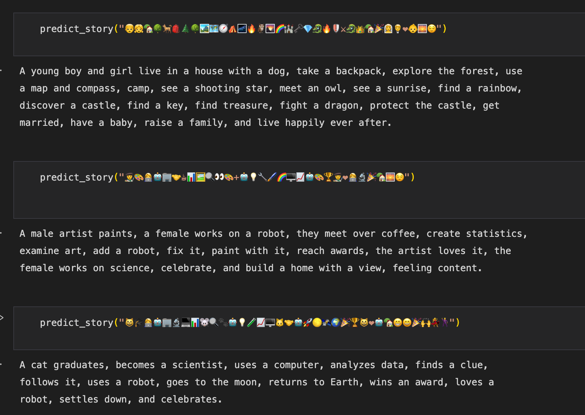
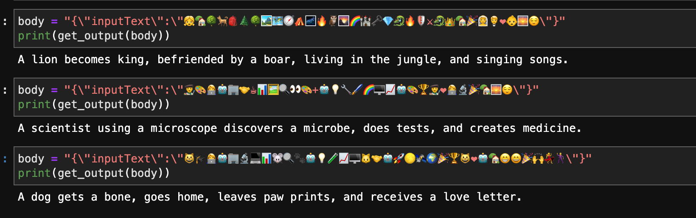

# Experiment

Fine tuning LLM to output a story based on emoji.

## Input dataset
1. [This](YT_Making_a_Emoticon_Stories_dataset_for_Fine_Tuning_PaLM_2_from_CSV_files.ipynb) notebook build a emoji dataset.
2. [This](YT_Using_PaLM_FT_Model_VertexAI.ipynb) notebook contains different examples of using palm fine tuning API.
3. [Finial dataset](dataset/emoji_stories.jsonl): 97 rows in total with emoji as input and a story based on the emoji as output
```
input: 🤠🐴🌵🏜️🚂💰🚓

output: "A cowboy with a horse in a desert witnesses a train robbery and then sees police coming."
```

Dataset credit to the video author Sam Witteveen.
[Video](https://www.youtube.com/watch?v=8TvdUycgCdY): this video contains different examples of palm model fine tuning.

## Result
From PaLM:


From Titan:
