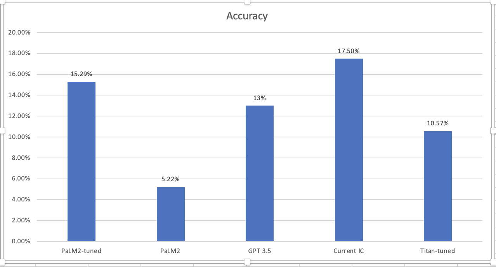

# Experiment

Fine tuning LLM to predict industry for a domain name

## Input dataset
1. Raw input dataset is generated by the sql query [here](https://github.com/hwang2-godaddy/industry-classification-for-jetpack/blob/main/dataset/query.sql) and saved in [dataset](dataset/query4_results.csv)
2. [This](build_training_dataset_fine_tuning.ipynb) notebook get 20 rows from each category and add instructions into the prompt for fine tuning.
3. [Finial dataset](dataset/output_v5.jsonl.zip): 16480 rows in total with one instructions+domain name and one correct industry category
```
input_text: Classify the following domain name into one of the following industries: [3dservices, abuseaddictiontreatment, accessories, ...(all categories, )] Domain name: seconstruction.ca

output_text: constructionservices
```

## Result
[Graph](accuracy_chart.png):   
